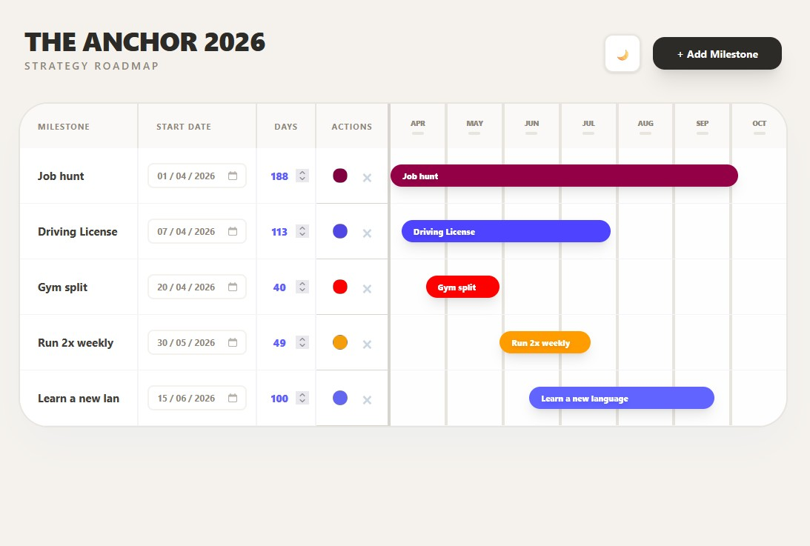

# THE ANCHOR (2026)

  

A high-fidelity strategy roadmap designed for clarity and timeline precision. Built with a minimalist oatmeal aesthetic, this custom Gantt implementation focuses on high-signal career and project tracking for the 2026 landscape.

## Core Tech
- **Next.js 15** (App Router)
- **Supabase** (Postgres persistence)
- **Tailwind CSS** (Custom grid architecture)

## Why this exists
Most roadmap tools are cluttered with enterprise bloat. This is a "low-noise" alternative built to visualize a 7-month cycle (Apr–Oct) on a single screen. No bulky Gantt libraries—just pure CSS Grid for pixel-perfect alignment and instant performance.

## Design Highlights
- **Oatmeal Minimalist UI:** Easy on the eyes, professional, and refined.
- **Adaptive Sorting:** Milestones re-order themselves chronologically in real-time.
- **Dark Mode:** A warm charcoal-oatmeal hybrid for late-night planning.
- **Fluid Grid:** Optimized to fit a full-year strategy without horizontal scrolling.

## Local Setup
1. Clone the repository.
2. Run `npm install`.
3. Set up your Supabase project and add `NEXT_PUBLIC_SUPABASE_URL` and `NEXT_PUBLIC_SUPABASE_ANON_KEY` to your `.env.local`.
4. Run `npm run dev`.

*Built for those who prefer precision over complexity.*
